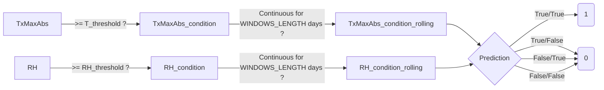

# BlastDT模型

BlastDT模型是基於決策樹(Decision Tree)設計之稻熱病(Rice Blast)預警模型。

# 計算流程
1. [氣象站列表](https://github.com/Raingel/weather_station_list)及[氣象資料](https://github.com/Raingel/historical_weather)會即時自github下載下來
2. 根據下面的流程計算結果
3. 結果會根據站號及年份建檔於prediction資料夾
(每日由github action功能自動執行更新)

## 備註
1. 本稻熱病決策樹公式(BlastDT)由行政院農業委員會農業試驗所陳繹年助理研究員開發
2. 原始氣象資料來源為[中央氣象局](https://www.cwb.gov.tw/)
3. 若欲引用本專案統整後的[氣象資料](https://github.com/Raingel/historical_weather)，可引用[https://doi.org/10.1016/j.ecoinf.2022.101950](https://doi.org/10.1016/j.ecoinf.2022.101950 )
4. 程式相關之討論可直接開Issue或與歐玠皜 allenstorm2005@gmail.com聯繫
